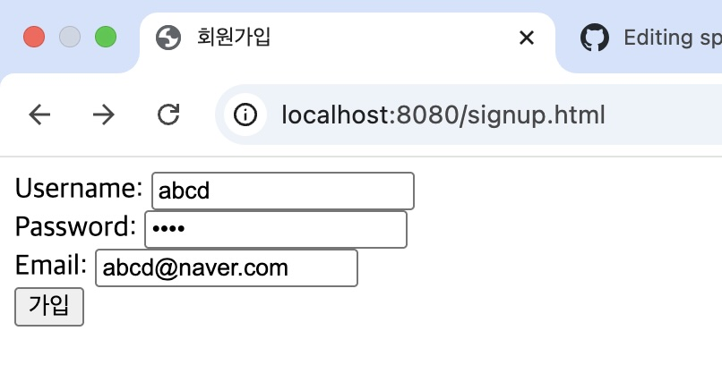

# springboot_basic
스프링 부트를 활용한 간단한 웹 서비스(초기 : 회원가입 기능)

### 1. docker 로 mysql 컨테이너 띄우기 
``` docker run -d --name mysql-member -p 3306:3306 -e MYSQL_ROOT_PASSWORD=***** -e MYSQL_DATABASE=memberdb mysql:8.0```

### 2. Java 애플리케이션 실행

### 3. http://](http://localhost:8080/members/signup 접속 및 회원가입 진행

